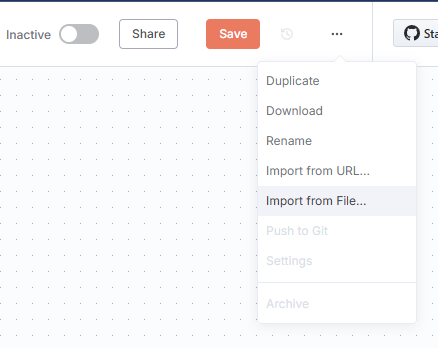
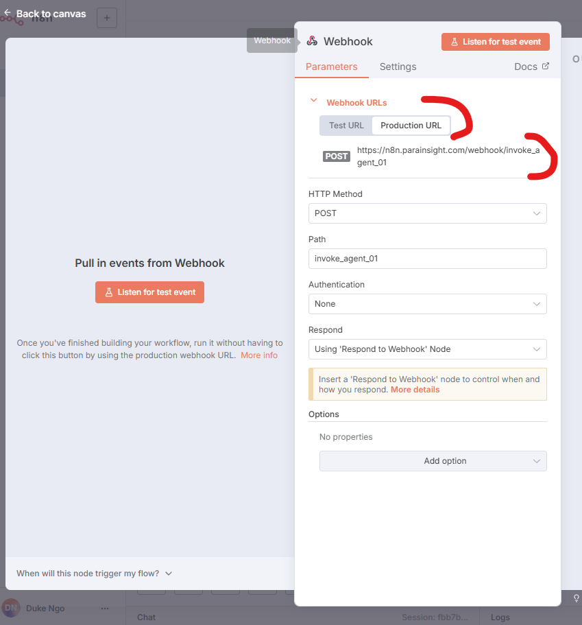
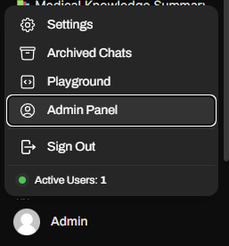
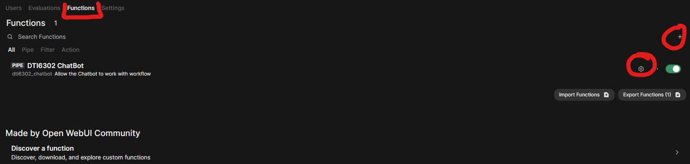
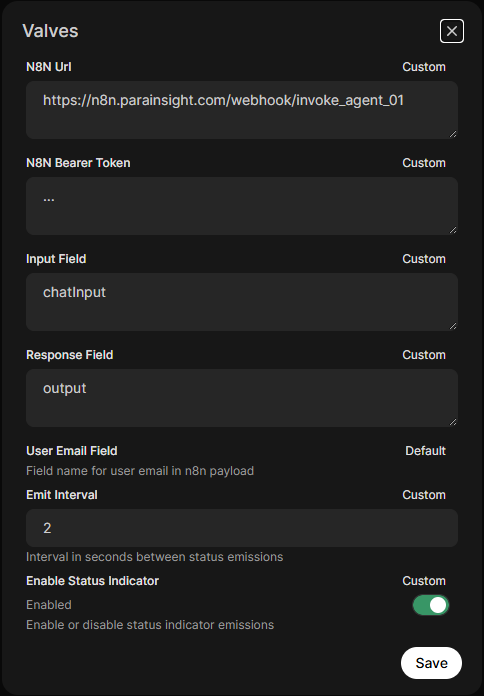
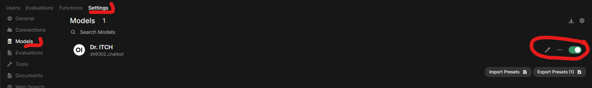

# Doctor Intelligent Tool for Clinical Help (Dr. Itch)
A Conversational AI Framework for Medical Education: Integrating Literature, Clinical Data, and Real-Time Research

This is the instruction to setup Dr. Itch on your local environement, the whole setup contains 3 main components: 
1. N8N Docker Container
2. OpenWebUI Docker Containers 
3. Python script to sync the eHospital Doctor Login information to OpenWebUI.


Overall steps that you should do: 
1. Make 2 containers up and running 
2. Import 3 N8N workflows into N8N container. 
3. Ensure 3 workflow will work.
4. Access OpenWebUI container.
5. Import the n8n_integration_function into Admin Setting/Function. 
6. Enable Chat Model from N8N. 
7. Sync the Login credential from ehospital. 


## Installation

### Prerequisites

- Python 3.8 or higher
- Docker and Docker Compose
- MySQL database access

### 1. Make 2 containers up and running

```bash
git clone https://github.com/ngohuuduc/dr_itch
cd dr_itch
```
#### Docker env setup 


Create the required external Docker network:

```bash
docker network create shared-net
docker compose pull 
```

#### Start Services

Launch the Docker services:

```bash
docker compose up -d
```

This will start:
- **N8n Workflow Automation** on port 5678
- **Open WebUI** on port 3200

#### Access the Application

- **Open WebUI**: http://localhost:3200
- **N8n**: http://localhost:5678  
You can configure your custom domain.

#### Configuration Notes

#### N8n Configuration
- Host: `localhost` or your custom domain. See docker compose file for more detail.
- Protocol: HTTPS
- Max payload size: 50MB 
- Community packages enabled

#### Open WebUI Configuration
- Runs on port 8080 inside container (mapped to 3200 on host)
- SQLite database mounted from host at `/root/openwebui-docker/webui.db`
- Connected to host network for internal services access

### 3. Import 3 workflows into N8N

- Create a workflow 
- select Impot from File (as screenshoot)

- make sure you had all the required credential for the workflows to work 
-- OpenAI 
-- PineCone Knowledge Basse
-- S3 Storage 
-- IMAP/SMTP 

- Make sure you have the correct webhook and workflow setup for production.



### 4. Configure OpenWebUI
1. Access Admin Panel

2. Add Python Function 

3. Add N8N webhook

4. Enable N8N Model 



### 5. eHospital Data Sync 

Create a `.env` file in the root directory with ehospital MySQL database setup. There is an example file that you can copy and edit. 

```env
DB_HOST=your_mysql_host
DB_PORT=3306
DB_NAME=your_database_name
DB_USERNAME=your_username
DB_PASSWORD=your_password
```

##### Python Dependencies

Install the required Python packages:

```bash
pip install -r requirements.txt
```


##### prior to run the script. please locate the pre-created database webui.db 
OpenWebUI default username/password for Adminin

- username: admin@test.ca
- password: dti6302

Run the hospital data synchronization script:

```bash
python ehospital_sync.py
```

This script will:
- Connect to your MySQL database
- Extract doctor registration data
- Hash passwords using bcrypt
- Create/update SQLite database (`webui.db`)
- Sync user data for the application


### Troubleshooting

1. **Database Connection Issues**: Verify your `.env` file contains correct database credentials
2. **Docker Network Error**: Ensure the `shared-net` network exists: `docker network create shared-net`
3. **Permission Issues**: Check that the SQLite database file path is accessible
4. **Port Conflicts**: Ensure ports 3200 and 5678 are available on your system

### File Structure

```
dr_itch/
├── README.md
├── ehospital_sync.py       # Data synchronization script
├── docker-compose.yml     # Docker services configuration
├── requirements.txt       # Python dependencies
├── .env                   # Environment variables (create this)
└── webui.db              # SQLite database (generated)
```
